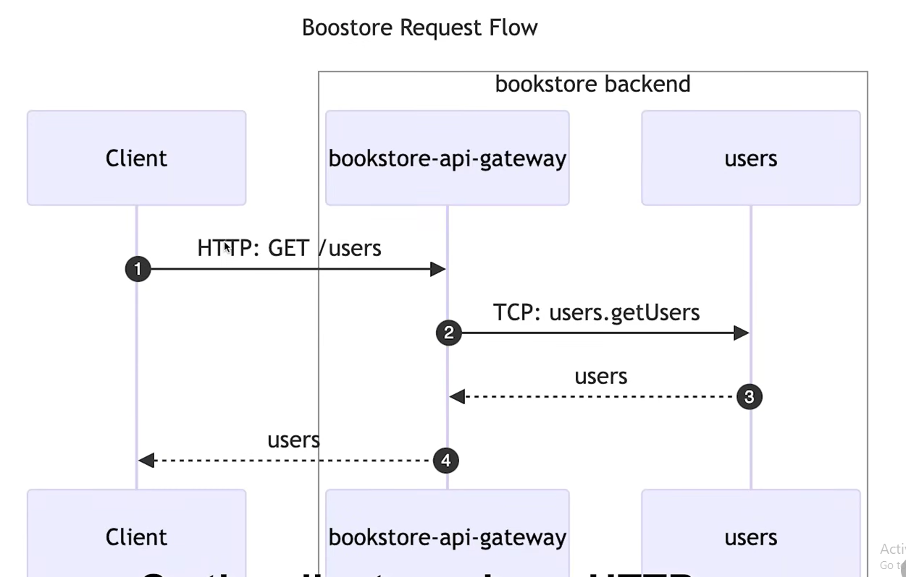
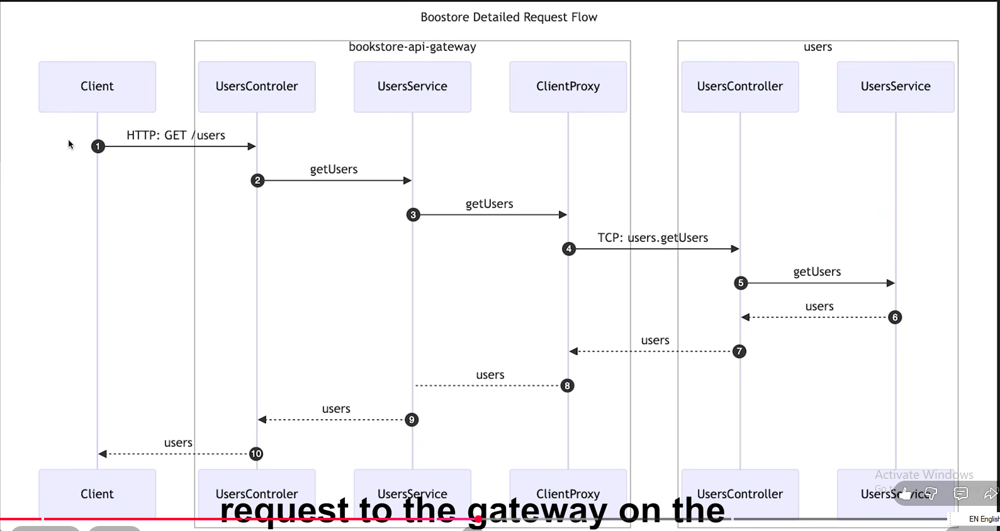

# 📚 Bookstore Microservice

Proje kurulum adımları ve uygulanan prosedürler:

### 1. API Gateway Oluşturma (MonoRepo için)
```bash
npx @nestjs/cli@10 generate app bookstore-api-gateway
```

### 2. Users Mikroservisi Oluşturma
```bash
npx @nestjs/cli@10 generate app users
```

### 3. Books Mikroservisi Oluşturma
```bash
npx @nestjs/cli@10 generate app books
```

### 4. nest-cli.json Dosyasında API Gateway'i Varsayılan Proje Yapma
Uygulamanın varsayılan (ana) giriş noktasını `bookstore-api-gateway` olarak ayarlamak için `nest-cli.json` ayarları şu şekilde güncellenir:

```json
{
  "$schema": "https://json.schemastore.org/nest-cli",
  "collection": "@nestjs/schematics",
  "sourceRoot": "apps/bookstore-api-gateway/src",
  "compilerOptions": {
    "deleteOutDir": true,
    "webpack": true,
    "tsConfigPath": "apps/bookstore-api-gateway/tsconfig.app.json"
  },
  "monorepo": true,
  "root": "apps/bookstore-api-gateway",
  "defaultProject": "bookstore-api-gateway"
}
```

### 5. Mikroservis Paketinin Kurulması
```bash
npm install @nestjs/microservices
```


### 6. API Gateway İçinde Users Modülü Oluşturma (Mikroservis Bağlantısı)
API Gateway içinden Users mikroservisine erişim ve bağlantı sağlamak için `bookstore-api-gateway` projesi altına `users` modülü eklenir:

```bash
npx @nestjs/cli@10 generate module users --project bookstore-api-gateway
```

### 7. API Gateway İçinde Users Servisi Oluşturma (Add Users Service to Users Module)
API Gateway içerisindeki `users` modülünün mikroservis istemcisi ve iş mantığı katmanını yönetmesi için `users` servisi eklenir:

```bash
npx @nestjs/cli@10 generate service users --project bookstore-api-gateway
```

### 8. API Gateway İçinde Users Controller Oluşturma (Add Users Controller to Users Module)
API Gateway içerisindeki `users` modülünün dış dünyadan (HTTP istemcilerinden) gelen istekleri karşılayıp yönlendirmesi için `users` controller eklenir:

```bash
npx @nestjs/cli@10 generate controller users --project bookstore-api-gateway
```

### 9. Servisleri Geliştirme (Watch) Modunda Çalıştırma ve Mimari Mantığı

Her bir uygulamayı veya mikroservisi ayrı bir terminal sekmesinde aşağıdaki komutlarla başlatırız. `--watch` parametresi, koddaki değişiklikleri canlı olarak algılayıp servisinizi otomatik olarak yeniden başlatır (Live Reload).

#### 🏨 Otel Benzetmesi (Dış Dünya vs İç Servisler)
Düşünün ki büyük bir otel işletiyorsunuz:

1. **1️⃣ Dış Dünyaya Açık Kapı = API Gateway (`bookstore-api-gateway`)**
   * **Resepsiyon Masası (API Gateway):**
     * Müşteriler (web siteniz, mobil uygulamanız, tarayıcı veya Postman) otele geldiğinde doğrudan mutfağa veya muhasebe odasına giremez. Önce kapıdaki Resepsiyona (`http://localhost:3000`) başvurur.
     * **"Dış dünyaya açık" demek:** İnternetten, dışarıdaki kullanıcılardan gelen HTTP isteklerini (URL adresini) doğrudan kabul edebilen tek kapı demektir.

2. **2️⃣ Gerçek Mikroservisler = `users` ve `books`**
   * **Muhasebe Odası:** `users` Mikroservisi (Port `3001`)
   * **Mutfak:** `books` Mikroservisi (Port `3002`)
   * **Neden Dış Dünyaya Kapalıdırlar?**
     * Dışarıdaki bir müşteri doğrudan mutfağa girip "Bana yemek pişir" diyemez. Müşterinin mutfağın telefon numarasını bilmesine gerek yoktur.
     * Müşteri isteğini kapıdaki Resepsiyona (API Gateway) iletir. Resepsiyon arka planda iç telefon hattıyla (TCP protokolü ile) Mutfağa (`books`) veya Muhasebeye (`users`) haber verir.
     * İşi yapan, veriyi işleyen ve saklayan asıl mikroservisler `users` ve `books` uygulamalarıdır.

#### 📊 Özet Tablo: Projenizde Hangisi Ne Oluyor?

| Uygulama                    | Türü                                   | Dış Dünyaya Açık mı?        | Nasıl İletişim Kurar?                | Görevi                                                                                      |
| :-------------------------- | :------------------------------------- | :-------------------------- | :----------------------------------- | :------------------------------------------------------------------------------------------ |
| **`bookstore-api-gateway`** | **API Gateway (Resepsiyon)**           | **EVET** (Port 3000)        | HTTP (`http://localhost:3000`)       | Dışarıdan gelen istekleri karşılar, güvenlik kontrolü yapar ve mikroservislere yönlendirir. |
| **`users`**                 | **Mikroservis (Kullanıcı Departmanı)** | **HAYIR** (Dışarıya Kapalı) | TCP (İç Ağ Mesajlaşması - Port 3001) | Kullanıcı bilgilerini saklar, sorgular ve API Gateway'e yanıt döner.                        |
| **`books`**                 | **Mikroservis (Kitap Departmanı)**     | **HAYIR** (Dışarıya Kapalı) | TCP (İç Ağ Mesajlaşması - Port 3002) | Kitap listesini, stok durumunu yönetir ve yanıt döner.                                      |

#### 🚀 Servis Çalıştırma Komutları:

- **1️⃣ API Gateway Servisini Çalıştırma:**
  ```bash
  npx nest start bookstore-api-gateway --watch
  ```

- **2️⃣ Users Mikroservisini Çalıştırma:**
  ```bash
  npx nest start users --watch
  ```

- **3️⃣ Books Mikroservisini Çalıştırma:**
  ```bash
  npx nest start books --watch
  ```

---

### 10. VS Code Üzerinde İstek Testi Yapma (`users.http`)

`npx nest start bookstore-api-gateway --watch` komutu çalışırken, isteklerinizi tarayıcı veya Postman açmadan doğrudan VS Code içinde test etmek için `users.http` dosyası kullanılır:

```http
GET http://localhost:3000/users
```

* 🎯 **VS Code'da İsteği Tetiklemek ve Yanıtı Görmek (`Send Request`):**
  1. VS Code eklenti mağazasından **"REST Client"** (*Huachao Mao*) eklentisini yükleyin.
  2. `users.http` dosyasını açıp `GET http://localhost:3000/users` kodunun üzerindeki mavi **`Send Request`** butonuna tıklayın.
  3. Sağ tarafta açılan yanıt penceresinde aşağıdaki gibi `HTTP/1.1 200 OK` ve `mock findAll response` çıktısı görüntülenecektir:

```http
HTTP/1.1 200 OK
X-Powered-By: Express
Content-Type: text/html; charset=utf-8
Content-Length: 21
ETag: W/"15-dP7gheiKMFhif1URmHUsX3T9cqs"
Date: Mon, 05 Oct 2026 15:19:18 GMT
Connection: close

mock findAll response
```

---

### 11. API Gateway ile Users Mikroservisi Arasında İletişim Kurma (TCP ClientProxy)

API Gateway'in sahte (mock) veri dönmek yerine gerçek `users` mikroservisiyle konuşmasını sağlamak için uygulanan adımlar:

#### 1️⃣ `apps/bookstore-api-gateway/src/users/users.module.ts` Dosyasına `ClientsModule` Tanımlanması
API Gateway'e `USERS_CLIENT` adında Port 3001'i dinleyen bir TCP istemcisi tanımlanır:

```typescript
import { Module } from '@nestjs/common';
import { UsersController } from './users.controller';
import { UsersService } from './users.service';
import { ClientsModule, Transport } from '@nestjs/microservices';

@Module({
  imports: [
    ClientsModule.register([
      {
        name: 'USERS_CLIENT',
        transport: Transport.TCP,
        options: { port: 3001 }, // Users mikroservisinin portu
      },
    ]),
  ],
  controllers: [UsersController],
  providers: [UsersService],
})
export class UsersModule {}
```

#### 2️⃣ `apps/bookstore-api-gateway/src/users/users.service.ts` Dosyasına `ClientProxy` Eklenmesi
`ClientProxy` enjekte edilerek TCP üzerinden `users.findAll` mesaj deseni `users` mikroservisine gönderilir:

```typescript
import { Injectable, Inject } from '@nestjs/common';
import { ClientProxy } from '@nestjs/microservices';

@Injectable()
export class UsersService {
  constructor(@Inject('USERS_CLIENT') private usersClient: ClientProxy) {}

  async findAll() {
    return this.usersClient.send('users.findAll', {});
  }
}
```

#### 3️⃣ İki Servisi Birlikte Çalıştırma ve Mikroservis İletişim Akışı
Tam mikroservis iletişimini başlatmak için iki farklı terminal sekmesinde servisler çalıştırılır:

- **Terminal 1:** `npx nest start bookstore-api-gateway --watch` (HTTP - Port 3000)
- **Terminal 2:** `npx nest start users --watch` (TCP - Port 3001)

<p style="display: flex; justify-content: space-between;  align-items: center">



</p>

#### 🔄 `npx nest start users --watch` Çalıştırıldığında Ne Gerçekleşti?


1. `api/users.http` dosyasından `GET http://localhost:3000/users` isteği atıldığında kapıdaki API Gateway (Port 3000) HTTP isteğini karşılar.
2. `UsersService`, `USERS_CLIENT` aracılığıyla arka planda Port 3001'de çalışan `users` mikroservisine TCP üzerinden `users.findAll` mesajını gönderir.
3. `users` mikroservisindeki `@MessagePattern('users.findAll')` mesajı yakalar ve `UsersService` içerisindeki kullanıcı listesini yanıt olarak döner.
4. API Gateway gelen yanıtı istemciye (REST Client / Browser) başarıyla iletir (`200 OK`):

```json
[
  {
    "id": 1,
    "name": "John ",
    "age": 25,
    "lastname": "Doe"
  },
  {
    "id": 2,
    "name": "Jack ",
    "age": 23,
    "lastname": "Smith"
  }
]
```
### 12. Mikroservislere CRUD Kaynağı (Resource) Ekleme (Books Service)

Mikroservisler için hazır CRUD (Create, Read, Update, Delete) uç noktaları ve veri yapıları üretmek için NestJS CLI `generate resource` komutu kullanılır.

#### 🛠️ Bizde Çalıştırılan Komut:
```bash
npx @nestjs/cli@10 generate resource books --project books
```

#### 📋 CLI İnteraktif Seçim Adımları:
1. **What transport layer do you use?** -> `Microservice (non-HTTP)` seçilir.
2. **Would you like to generate CRUD entry points?** -> `Yes` (Y) seçilir.

---

#### 📂 Yapılan Değişiklikler ve Dosya Yapısı:

1. **Ana Modül (`apps/books/src/books-app.module.ts`):**
   - Uygulamanın kök modülü `BooksAppModule` olarak tanımlandı ve üretilen `BooksModule` buraya import edildi.

2. **`apps/books/src/main.ts` (TCP Port 3002 Yapılandırması):**
   ```typescript
   import { NestFactory } from '@nestjs/core';
   import { BooksAppModule } from './books-app.module';
   import { MicroserviceOptions, Transport } from '@nestjs/microservices';

   async function bootstrap() {
     const app = await NestFactory.createMicroservice<MicroserviceOptions>(
       BooksAppModule,
       {
         transport: Transport.TCP,
         options: { port: 3002 },
       },
     );
     await app.listen();
   }
   bootstrap();
   ```

3. **`apps/books/src/books/books.controller.ts` (CRUD Mesaj Desenleri):**
   - `@MessagePattern('createBook')` -> Yeni kitap ekleme
   - `@MessagePattern('findAllBooks')` -> Tüm kitapları listeleme
   - `@MessagePattern('findOneBook')` -> ID ile kitap getirme
   - `@MessagePattern('updateBook')` -> Kitap güncelleme
   - `@MessagePattern('removeBook')` -> Kitap silme

4. **DTO ve Entity Klasör Yapısı (`apps/books/src/books/`):**
   - `dto/create-book.dto.ts`
   - `dto/update-book.dto.ts`
   - `entities/book.entity.ts`
   - `books.service.ts`
   - `books.module.ts`

---

### 13. API Gateway İçinde Books Kaynağı (REST API Resource) Oluşturma

API Gateway'in dış dünyadan (HTTP istemcilerinden) gelen kitap isteklerini karşılaması için `REST API` türünde `books` kaynağı üretilir.

#### 🛠️ Bizde Çalıştırılan Komut:
```bash
npx @nestjs/cli@10 generate resource books --project bookstore-api-gateway
```

#### 📋 CLI İnteraktif Seçim Adımları:
1. **What transport layer do you use?** -> `REST API` seçilir.
2. **Would you like to generate CRUD entry points?** -> `Yes` (Y) seçilir.

---

#### 📂 Yapılan Değişiklikler ve Dosya Yapısı:

1. **`apps/bookstore-api-gateway/src/books/books.controller.ts` (REST API Endpoints):**
   - `@Post()` -> Yeni kitap oluşturma endpoint'i
   - `@Get()` -> Tüm kitapları listeleme endpoint'i
   - `@Get(':id')` -> ID bazlı kitap getirme endpoint'i
   - `@Patch(':id')` -> Kitap güncelleme endpoint'i
   - `@Delete(':id')` -> Kitap silme endpoint'i

2. **`apps/bookstore-api-gateway/src/bookstore-api-gateway.module.ts`:**
   - Üretilen `BooksModule`, `BookstoreApiGatewayModule` içerisine `imports` olarak bağlandı.

---

### 14. API Gateway ile Books Mikroservisi İletişimi ve `api/books.http` Testleri

API Gateway'in `books` mikroservisine (TCP Port 3002) bağlanması ve istekleri yönlendirmesi için yapılan adımlar:

#### 1️⃣ `apps/bookstore-api-gateway/src/books/books.module.ts` Yapılandırması (`BOOKS_CLIENT`)
API Gateway'e Port 3002'deki `books` mikroservisi için `BOOKS_CLIENT` tanımlanır:

```typescript
import { Module } from '@nestjs/common';
import { BooksService } from './books.service';
import { BooksController } from './books.controller';
import { ClientsModule, Transport } from '@nestjs/microservices';

@Module({
  imports: [
    ClientsModule.register([
      {
        name: 'BOOKS_CLIENT',
        transport: Transport.TCP,
        options: { port: 3002 },
      },
    ]),
  ],
  controllers: [BooksController],
  providers: [BooksService],
  exports: [BooksService],
})
export class BooksModule {}
```

#### 2️⃣ Servisleri Çalıştırma
- **API Gateway (HTTP Kapısı):** `npx nest start bookstore-api-gateway --watch` (Port 3000)
- **Books Mikroservisi (TCP İletişimi):** `npx nest start books --watch` (Port 3002)

#### 3️⃣ `api/books.http` Test Dosyası
*(Önemli Not: HTTP istekleri doğrudan iç mikroservisin TCP portuna (3002) atılamaz. Tüm HTTP istekleri dış kapı olan API Gateway'e (`http://localhost:3000/books`) gönderilmelidir).*

```http
### 1. Tüm kitapları getir
GET http://localhost:3000/books

### 2. ID'ye göre kitap getir
GET http://localhost:3000/books/1

### 3. Yeni kitap ekle
POST http://localhost:3000/books
Content-Type: application/json

{
  "title": "Test book post",
  "author": "Test author",
  "rating": 3
}

### 4. Kitap güncelle
PATCH http://localhost:3000/books/1
Content-Type: application/json

{
  "title": "Book 1 Updated",
  "author": "Author 1 Updated",
  "rating": 3
}

### 5. Kitap sil
DELETE http://localhost:3000/books/1
```

---

### 15. Monorepo Ortak Kontrat Kütüphanesi (`libs/contracts`) Oluşturma ve DTO'ları Paylaşma

Mikroservisler ile API Gateway arasında kod tekrarını önlemek ve DTO/Arayüz kontratlarını tek bir ortak noktadan yönetmek için `contracts` kütüphanesi üretilir.

#### 1️⃣ Ortak Kütüphane Üretme Komutu:
```bash
npx @nestjs/cli@10 generate library contracts
```

#### 2️⃣ Varsayılan Şablon Kodlarını Temizleme:
```bash
rm -rf libs/contracts/src/*
```

#### 3️⃣ Kitap DTO Klasörünü Oluşturma:
```bash
mkdir libs/contracts/src/books
```

#### 4️⃣ DTO Dosyalarını Ortak Kütüphaneye Kopyalama:
```bash
cp apps/books/src/books/dto/* libs/contracts/src/books
```

---

#### 📂 Oluşan Kütüphane Yapısı (`libs/contracts/src/`):

- **`libs/contracts/src/books/book.dto.ts`** -> Genel Kitap DTO nesnesi.
- **`libs/contracts/src/books/create-book.dto.ts`** -> Yeni Kitap Ekleme DTO nesnesi.
- **`libs/contracts/src/books/update-book.dto.ts`** -> Kitap Güncelleme DTO nesnesi.
- **`libs/contracts/src/index.ts`** -> Tüm kontratların tek noktadan `@app/contracts` adı altında dışa aktarılması.

---

### 16. Tip Güvenlikli Mesaj Desenleri (`BOOK_PATTERNS`) ve API Gateway DTO Mantığı

Mikroservisler arası iletişimde hataları önlemek amacıyla düz metin dizileri (hardcoded strings) yerine sabit desenler (`BOOK_PATTERNS`) ve TypeScript tip jenerikleri kullanılır.

#### 1️⃣ Mesaj Desenlerinin Sabitlenmesi (`libs/contracts/src/books/book.patterns.ts`):
```typescript
export const BOOK_PATTERNS = {
  CREATE: 'books.create',
  FIND_ALL: 'books.findAll',
  FIND_ONE: 'books.findOne',
  UPDATE: 'books.update',
  REMOVE: 'books.remove',
};
```

#### 2️⃣ API Gateway Servisinde Tip Güvenliği (`apps/bookstore-api-gateway/src/books/books.service.ts`):
`ClientProxy.send<ResponseType, RequestType>` jeneriği kullanılarak TCP mesajlarında ne tür veri gönderilip ne tür yanıt alınacağı tip düzeyinde garanti altına alınır:

```typescript
import { Inject, Injectable } from '@nestjs/common';
import {
  BOOK_PATTERNS,
  BookDto as ClientBookDto,
  CreateBookDto as ClientCreateBookDto,
  UpdateBookDto as ClientUpdateBookDto,
} from '@app/contracts';
import { ClientProxy } from '@nestjs/microservices';

import { CreateBookDto } from './dto/create-book.dto';
import { UpdateBookDto } from './dto/update-book.dto';

@Injectable()
export class BooksService {
  constructor(@Inject('BOOKS_CLIENT') private readonly booksClient: ClientProxy) {}

  create(createBookDto: CreateBookDto) {
    return this.booksClient.send<ClientBookDto, ClientCreateBookDto>(
      BOOK_PATTERNS.CREATE,
      createBookDto,
    );
  }

  findAll() {
    return this.booksClient.send<ClientBookDto[]>(BOOK_PATTERNS.FIND_ALL, {});
  }
}
```

---

#### 💡 Neden API Gateway Kendi DTO'sunu Tutarken Ortak Kontrat DTO'sunu da Import Eder?

1. **Gelen Veri (Inbound HTTP):** API Gateway, dış dünyadan (HTTP POST/PATCH isteklerinden) gelen veriyi kendi yerel `./dto/create-book.dto.ts` sınıfı ile karşılar. HTTP doğrulama kuralları (`class-validator`: `@IsString()`, `@IsNumber()`) burada tanımlanır.
2. **Giden Veri (Outbound TCP):** API Gateway, mikroservise TCP ile mesaj gönderirken mikroservisin beklediği resmi sözleşme tipini (`ClientCreateBookDto`) tip jeneriği olarak kullanır.
3. **Geliştirme Esnekliği (Separation of Concerns):** Dış dünyaya açılan REST API veri modelleri ile mikroservisler arası iç iletişim modelleri birbirinden bağımsız evrilebilir.

---

### 17. Dinamik Mikroservis Konfigürasyonu (`client-config`) ve `ClientProxyFactory`

Hardcoded (sabit kodlanmış) port numaraları yerine, mikroservis bağlantılarını ortam değişkenlerinden (`.env`) okuyan ve `joi` ile doğrulayan dinamik konfigürasyon yapısına geçilmiştir.

#### 1️⃣ Symbol Tabanlı Enjeksiyon Anahtarları (`constant.ts`)
Metinsel (`'BOOKS_CLIENT'`) string ifadeleri yerine TypeScript tip güvenliği sağlayan `Symbol` ifadeleri kullanılır:
- `apps/bookstore-api-gateway/src/books/constant.ts`:
  ```typescript
  export const BOOKS_CLIENT = Symbol('BOOKS_CLIENT');
  ```
- `apps/bookstore-api-gateway/src/users/constant.ts`:
  ```typescript
  export const USERS_CLIENT = Symbol('USERS_CLIENT');
  ```

#### 2️⃣ `client-config` Modülü (`@nestjs/config` & `joi`)
Mikroservis portlarını ortam değişkenlerinden (`USERS_CLIENT_PORT`, `BOOKS_CLIENT_PORT`) okumak ve `joi` kütüphanesi ile doğrulama şeması oluşturmak için `ClientConfigModule` ve `ClientConfigService` eklenmiştir.

- **`apps/bookstore-api-gateway/src/client-config/client-config.module.ts`**:
  ```typescript
  import { Module } from '@nestjs/common';
  import { ConfigModule } from '@nestjs/config';
  import * as joi from 'joi';
  import { ClientConfigService } from './client-config.service';

  @Module({
    imports: [
      ConfigModule.forRoot({
        isGlobal: false,
        validationSchema: joi.object({
          USERS_CLIENT_PORT: joi.number().default(3001),
          BOOKS_CLIENT_PORT: joi.number().default(3002),
        }),
      }),
    ],
    providers: [ClientConfigService],
    exports: [ClientConfigService],
  })
  export class ClientConfigModule {}
  ```

- **`apps/bookstore-api-gateway/src/client-config/client-config.service.ts`**:
  ```typescript
  import { Injectable } from '@nestjs/common';
  import { ConfigService } from '@nestjs/config';
  import { ClientOptions, Transport } from '@nestjs/microservices';

  @Injectable()
  export class ClientConfigService {
    constructor(private readonly config: ConfigService) {}

    getBooksClientPort(): number {
      return this.config.get<number>('BOOKS_CLIENT_PORT') ?? 3002;
    }

    getUsersClientPort(): number {
      return this.config.get<number>('USERS_CLIENT_PORT') ?? 3001;
    }

    get booksClientOptions(): ClientOptions {
      return {
        transport: Transport.TCP,
        options: {
          port: this.getBooksClientPort(),
        },
      };
    }

    get usersClientOptions(): ClientOptions {
      return {
        transport: Transport.TCP,
        options: {
          port: this.getUsersClientPort(),
        },
      };
    }
  }
  ```

#### 3️⃣ Custom Provider ve `ClientProxyFactory.create` Kullanımı
Modüllerde (`BooksModule` & `UsersModule`) istemcileri dinamik olarak üretmek için `ClientProxyFactory.create` fabrikası entegre edilmiştir:

- **`apps/bookstore-api-gateway/src/books/books.module.ts`**:
  ```typescript
  import { Module } from '@nestjs/common';
  import { ClientProxyFactory } from '@nestjs/microservices';

  import { ClientConfigModule } from '../client-config/client-config.module';
  import { ClientConfigService } from '../client-config/client-config.service';
  import { BooksController } from './books.controller';
  import { BooksService } from './books.service';
  import { BOOKS_CLIENT } from './constant';

  @Module({
    imports: [ClientConfigModule],
    controllers: [BooksController],
    providers: [
      BooksService,
      {
        provide: BOOKS_CLIENT,
        useFactory: (configService: ClientConfigService) => {
          const clientOptions = configService.booksClientOptions;
          return ClientProxyFactory.create(clientOptions);
        },
        inject: [ClientConfigService],
      },
    ],
    exports: [BooksService],
  })
  export class BooksModule {}
  ```